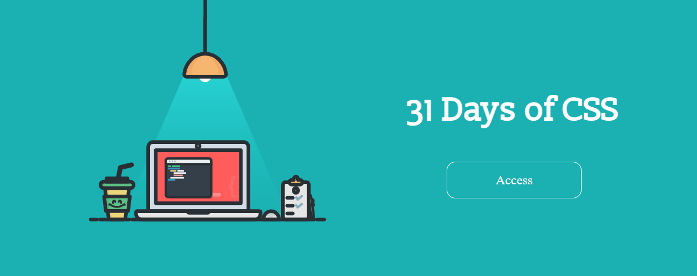
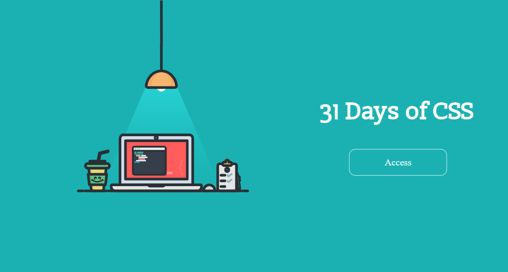
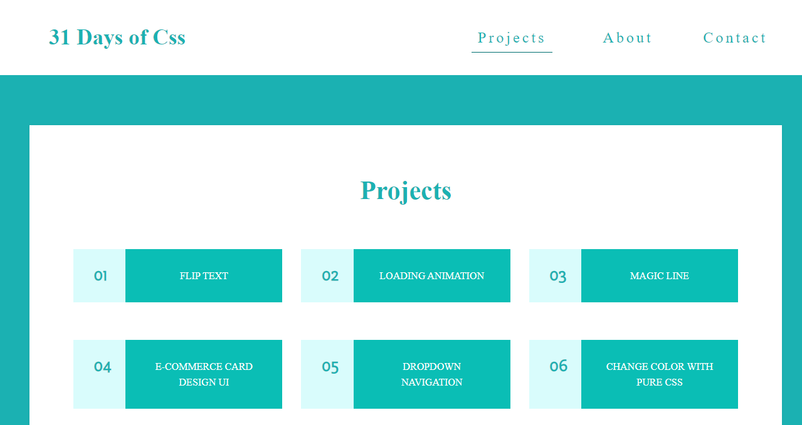
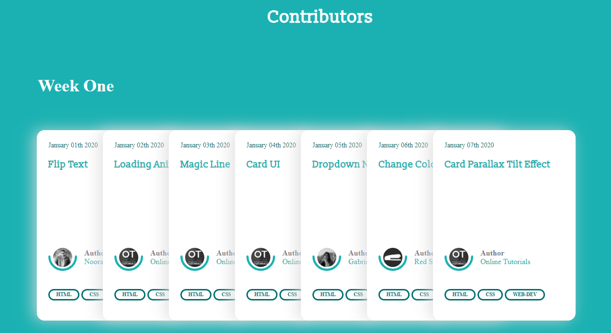
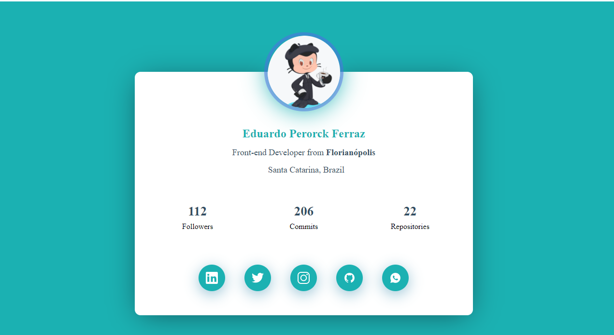

  

<h1 align="center">31 Days of CSS</h1>

 :rocket: Daily challenges to get to the next level :rocket:

<h4 align="center"> 
	🚧  In Construction...  🚧
</h4>

Table of contents
=================
   * [Table of contents](#table-of-contents)
   * [About](#about)
   * [Installation](#installation)
   * [Projects](#projects)
      * [#01 - Flip Text](#flip-text)  
      * [#02 - Loading Animation](#loading-animation) 
      * [#03 - Magic Line](#magic-line) 
      * [#04 - E-Commerce Card Design UI](#ecommerce-card) 
      * [#05 - Dropdown Navigation](#dropdown-navigation)
      * [#06 - Change Color With Pure CSS](#color-css) 
      * [#07 - Card Parallax Tilt Effect](#card-tilt-effect) 
      * [#08 - Inspired Loader](#inspired-loader) 
      * [#09 - Text Neon Animation](#text-neon) 
      * [#10 - Typewriter](#typewriter) 
      * [#11 - Spin Hover Effect](#spin-hover) 
      * [#12 - 3D Flip](#3d-flip)
      * [#13 - Rotating Image Gallery](#rotating-gallery) 
      * [#14 - Emoji Reactions](#emoji-reactions) 
      * ...
   * [Technologies](#technologies)
   * [License](#license)
   * [Author](#author)

<h2 id="about"> 💡 About </h2> 

Inspired by a challenge proposed by dev Morena Nobre the challenge consists of daily challenges for 31 days
the CSS language along with HTML and JavaScript to make amazing styles and effects.

 - You can access the project website by clicking  <a href="https://edupferraz.github.io/31-Days-Css/pages/">here</a>

  

  
  
  
  
  
  
  

<h2 id="installation"> :computer: Installation </h2> 

> Em breve...

<h2 id="projects"> 💡 Projects </h2> 
 
> Em breve...

<h2 id="technologies"> 🛠️ Technologies </h2> 

The tools used in the development of projects

- HTML
- CSS
- JS
- ...

<h2 id="license"> :memo: License </h2> 

 The project is under MIT license 

<h2 id="author"> :rocket:  Author </h2>  

 Made with :blue_heart: by Eduardo Perorck Ferraz 

   
