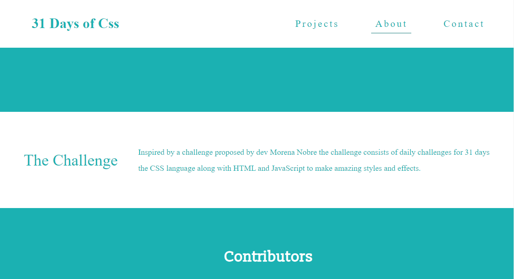

  

<h1 align="center">31 Days of CSS</h1>

 :rocket: Daily challenges to get to the next level :rocket:

<h4 align="center"> 
	🚧  In Construction...  🚧
</h4>

Table of contents
=================
   * [Table of contents](#table-of-contents)
   * [About](#about)
   * [Installation](#installation)
   * [Weeks](#weeks)
   * [Projects](#projects)
      * [#01 - Flip Text](#flip-text)  
      * [#02 - Loading Animation](#loading-animation) 
      * [#03 - Video Inside Text](#video-text) 
      * [#04 - E-Commerce Card Design UI](#ecommerce-card) 
      * [#05 - Button Animation](#button-animation)
      * ...
   * [Technologies](#technologies)
   * [License](#license)
   * [Author](#author)

<h2 id="about"> 💡 About </h2> 

Inspired by a challenge proposed by dev Morena Nobre the challenge consists of daily challenges for 31 days
the CSS language along with HTML and JavaScript to make amazing styles and effects.

 - You can access the project website by clicking  <a href="https://edupferraz.github.io/31-Days-Css/pages/">here</a>

  

  
  
  
  
  
  
  

<h2 id="installation"> :computer: Installation </h2> 

## Requirements

Before you start, you will need to have installed on your machine the following tools:
[Git](https://git-scm.com). 
Besides, it's good to have an editor to work with the code as [VSCode](https://code.visualstudio.com/)

### Clone this repository
$ git clone <https://github.com/edupferraz/31-Days-Css.git>

### Have fun!
Now with the clone on your machine just access it by VsCode and let your imagination act!

<h2 id="weeks"> :rocket: Weeeks</h2>

 Semana 01 - Conceitos básicos do Css e elementos básicos de uma página

 ...

<h2 id="projects"> 💡 Projects </h2> 
 

	<a href="https://edupferraz.github.io/31-Days-Css/pages/projects/day1/day1.html"> #01 - Flip Text </a>
	
Neste projeto o conceito princiap aprendido é o do keyframe para animações e as possibilidades de uso.

	
In this project the main concept learned is that of keyframe for animations and the possibilities of use.

	<a href="https://edupferraz.github.io/31-Days-Css/pages/projects/day2/day2.html"> #02 - Loading Animation </a>
	
Nesse projeto usei o conceito aprendido anteriormente do keyframe e juntamos isso para fazer esse efeito incrível.

	
In this project I used the previously learned concept of the keyframe and put it together to make this amazing effect.

	<a href="https://edupferraz.github.io/31-Days-Css/pages/projects/day3/day3.html"> #03 - Video Inside Text </a>
	
Esse efeito incrível foi feito utilizando propriedades básicas como o position porém se usadas corretamente criamos coisas surpreendentes.

	
This amazing effect was done using basic properties like position but if used correctly we create amazing things.

	<a href="https://edupferraz.github.io/31-Days-Css/pages/projects/day4/day4.html"> #04 - Ecommerce Card</a>
	
Esse foi o projeto que de longe foi o que mais aprendi até agora. É um conjunto de todas os conceitos básicos do CSS que fazem um efeito que eu gostei muito e pretendo aderir futuramente!

	
That was the project that by far was what I learned the most so far. It is a set of all the basics of CSS that make an effect that I liked a lot and intend to adhere to in the future!

	<a href="https://edupferraz.github.io/31-Days-Css/pages/projects/day5/day5.html"> #01 - Button Animation </a>
	
Esse efeito de botões durante o hover foi onde aprendi mais sobre a manipulação dos elementos pelo position e pelo animation/@keyframes.

	
This button effect during hover was where I learned more about handling elements by position and animation/@keyframes.

<h2 id="technologies"> 🛠️ Technologies </h2> 

The tools used in the development of projects

- HTML
- CSS
- JS
- ...

<h2 id="license"> :memo: License </h2> 

 The project is under MIT license 

<h2 id="author"> :rocket:  Author </h2>  

 Made with :blue_heart: by Eduardo Perorck Ferraz 

   
